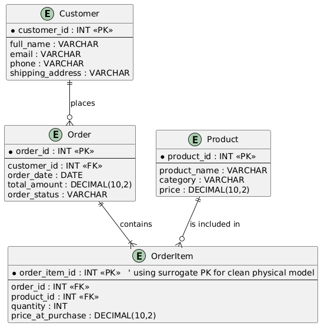

# ER Diagram Documentation

This document provides an overview of the Entity-Relationship (ER) Diagram used in the project.  
It explains the data model, core entities, relationships, and cardinality rules that guide the database design.

---

## Overview

The ER diagram represents the **conceptual and physical structure** of the system’s database.  
It captures the key business objects—such as **Customer**, **Order**, **Product**, and **OrderItem** and illustrates how these entities interact with one another.

The model ensures:

- Clear entity definitions  
- Proper use of primary keys and foreign keys  
- Accurate representation of cardinalities (e.g., one-to-many, many-to-many resolved via a junction table)  
- Conformance to normalization and relational database standards  

---

## ER Diagram

---

## File Location

All ER-diagram–related assets are stored in the **`er_diagram/`** folder, including:

- The **PlantUML code** used to generate the diagram  
- The **rendered ER diagram image** (PNG/SVG)  

PlantUML code was used to make updating the er diagram easily if the database design evolves.

---

## Summary of Entities & Relationships

### **Customer**
Represents individuals placing orders.  
Participates in a **1-to-many** relationship with Order (a customer can place zero or many orders).

### **Order**
Represents a purchase transaction.  
Must include **at least one OrderItem**, forming a **1-to-many** relationship.

### **Product**
Represents purchasable items in the system.  
Can appear in zero or many OrderItems, depending on whether it has ever been sold.

### **OrderItem**
Serves as the **junction (associative) entity** linking Orders and Products.  
Implements the many-to-many relationship by storing:
- Product ID  
- Order ID  
- Quantity  
- Purchase price at the time of order  

**Surrogate Key Explanation:**  
- Although `OrderItem` has a **composite primary key** of (`order_id`, `product_id`), we also include a **surrogate key (`order_item_id`)** to:
  - Simplify indexing and joins in queries  
  - Avoid complications when referencing order items from other tables in the future  
  - Make updates and deletions cleaner without relying on a composite key  
- The surrogate key does **not replace** the composite key; it complements it for implementation convenience.

---

## 🔗 Cardinality Notes

- **Customer to Order:** Zero or Many (`o{`)  
  - **Minimum:** 0, a newly registered customer may have no orders yet  
  - **Maximum:** many, a customer can place many orders over time  

- **Order to OrderItem:** One or Many (`|{`)  
  - **Minimum:** 1, an order must contain at least one item; an order with zero items is invalid  
  - **Maximum:** many, an order can contain multiple different products  

- **Product to OrderItem:** Zero or Many (`o{`)  
  - **Minimum:** 0, a product may have never been ordered  
  - **Maximum:** many, a product can appear in multiple orders or order items

---

## Notes

- This document is a **partial README** focused solely on the ER diagram.  
- A full project README will integrate this section along with setup instructions, schema details, and application logic.

---
